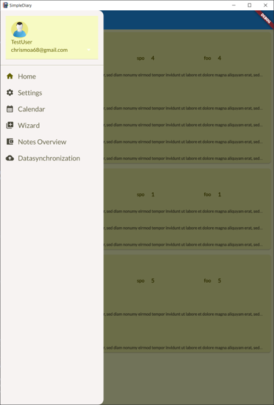

# SimpleDiary

Just a simple diary app which is used for my further projects



# Getting started

## Install the Develop-Environment

### Flutter

follow the instruction on: https://docs.flutter.dev/get-started/install/windows and select your platform
The installation might be a bit difficult but it was well described at the flutter installation homepage above.

### IDE

In this project VS-Code is applied as IDE:
https://code.visualstudio.com/download

It is also a good step to download the package "Flutter" within VS-Code

## adding the environmental variables

- examples from: https://pub.dev/packages/flutter_dotenv
- Copy the "template.env" and rename it to ".env" and fill in infos to work
- If the project doesnt find the ".env"-file it wont build

:warning: Do not add the ".env" to the public git repo :warning:

# code structure

... This should be added soon

# Useful code commands

## build the project

### windows

```bash
   flutter build windows
```

### android

```bash
   flutter build apk
```

### Web

```bash
   flutter build web
```

### linux
```bash
   flutter build linux
```

This is only supported on a linux machine. Be sure that all required packages and libraries are installed. On ubuntu it needs for example the *libsqlite3-0* and *libsqlite3-dev* library. Build the app in the debug mode if some other packages are required. There can be a requirements installer for this project which will install all needed libraries and packages.

or debug with debug information:
```bash
   flutter run -d linux -v
```

## adding an app image

1. insert the icon to the asset folder
2. set the directory the "pubspec.yaml" under "flutter_icons:
   android: true
   ios: true
   linux: true
   image_path: "assets/app_logo.png"
3.

```bash
   flutter pub add flutter_launcher_icons
```

4.

```bash
   flutter pub get
```

5.

```bash
   flutter pub run flutter_launcher_icons:main
```

## finding the dart and flutter packages

PubDev: https://pub.dev/
