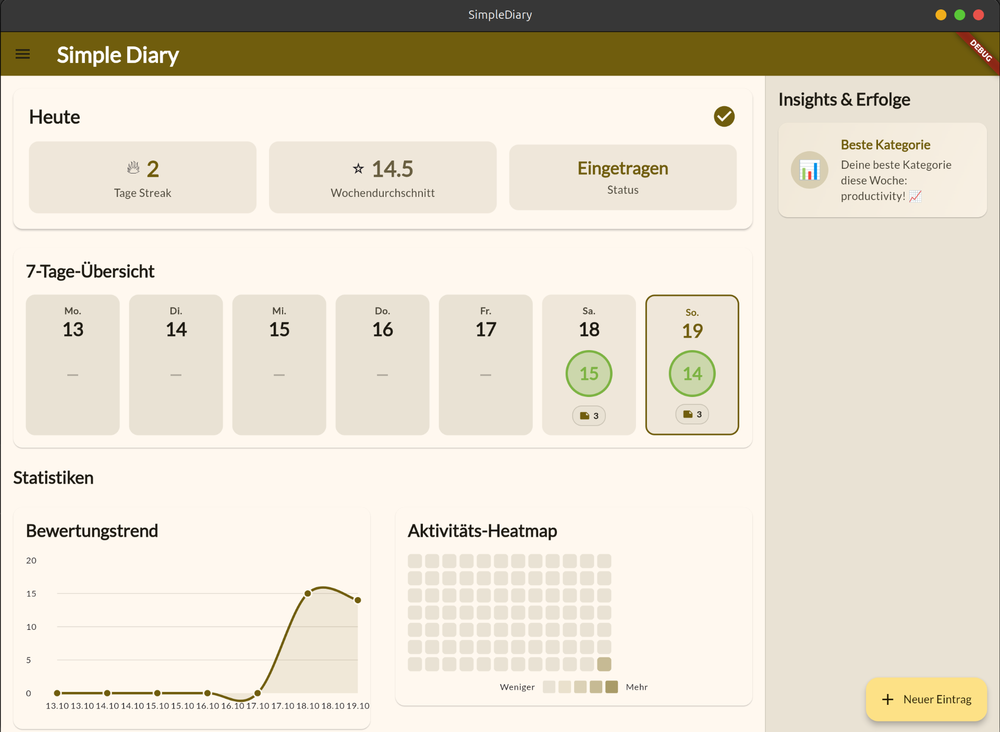
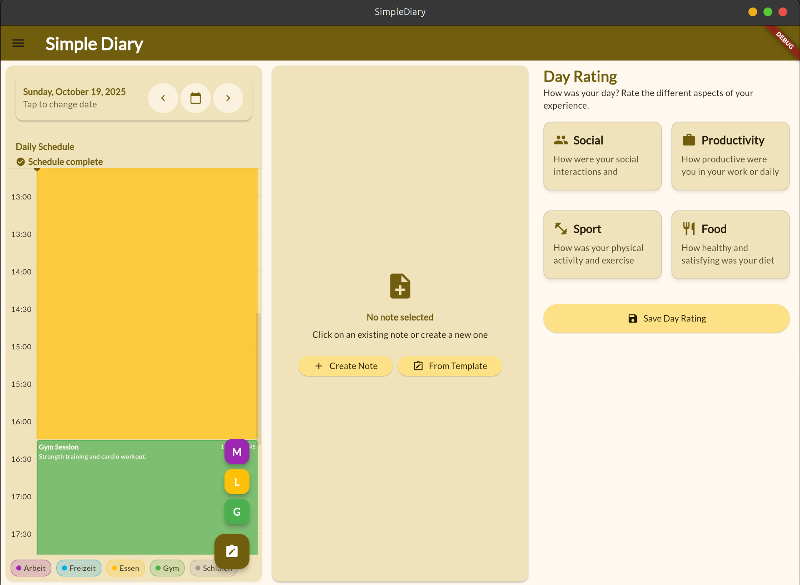
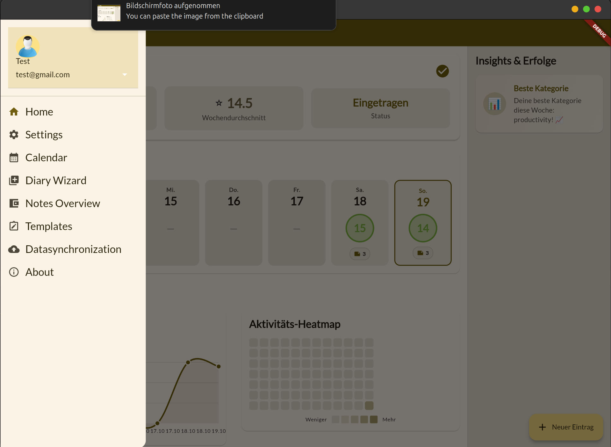

# SimpleDiary 📔

> A modern, feature-rich diary application built with Flutter for tracking your daily activities, moods, and personal growth.



## ✨ Features

### 📊 Comprehensive Dashboard
- **Quick Stats Overview**: Track your current streak, weekly average scores, and daily status at a glance
- **7-Day Overview**: Visual representation of your week with color-coded scores
- **Mood Trend Chart**: Line chart showing your emotional journey over time
- **Activity Heatmap**: GitHub-style contribution graph for your diary entries
- **Insights & Achievements**: Smart suggestions and milestone tracking

### 📝 Intelligent Diary Wizard


- **Step-by-step guided entry**: Structured approach to daily journaling
- **Category-based tracking**: Rate different aspects of your day (Work, Leisure, Sleep, Gym, etc.)
- **Custom templates**: Create and use personalized note templates
- **Rich text notes**: Add detailed descriptions for each category
- **Score calculation**: Automatic overall score based on your ratings

### 🎨 Customizable Theming
- **Dynamic color schemes**: Choose your preferred theme color
- **Dark mode support**: Full dark theme with optimized contrast
- **Material Design 3**: Modern, clean interface following latest design guidelines
- **Responsive layout**: Optimized for desktop, tablet, and mobile devices

### 🔐 Data Management
- **Local-first approach**: Your data stays on your device
- **SQLite database**: Fast and reliable local storage
- **Supabase integration**: Optional cloud backup and sync
- **Encryption support**: Secure your sensitive diary entries

### 🎯 Additional Features


- **Multi-user support**: Separate diaries for different users
- **Search & filter**: Quickly find past entries
- **Export functionality**: Backup your diary data
- **Cross-platform**: Works on Windows, Linux, Android, and Web

## 🚀 Getting Started

### Prerequisites

- Flutter SDK (3.0 or higher)
- Dart SDK (3.0 or higher)
- For desktop builds: Platform-specific requirements (see below)

### Installation

1. **Clone the repository**
   ```bash
   git clone https://github.com/yourusername/SimpleDiary.git
   cd SimpleDiary
   ```

2. **Install dependencies**
   ```bash
   flutter pub get
   ```

3. **Set up environment variables**
   - Copy `template.env` to `.env`
   - Fill in your configuration (Supabase credentials, etc.)
   - ⚠️ **Never commit `.env` to version control!**

4. **Run the app**
   ```bash
   flutter run -d <platform>
   ```

## 🛠️ Development Environment Setup

### Flutter

follow the instruction on: https://docs.flutter.dev/get-started/install/windows and select your platform
The installation might be a bit difficult but it was well described at the flutter installation homepage above.

### IDE

In this project VS-Code is applied as IDE:
https://code.visualstudio.com/download

It is also a good step to download the package "Flutter" within VS-Code


## 📁 Project Structure

```
lib/
├── core/                    # Core functionality
│   ├── navigation/         # App navigation & routing
│   ├── provider/           # Riverpod providers
│   ├── settings/           # App settings management
│   ├── theme/              # Theme configuration
│   └── utils/              # Utility functions
├── features/               # Feature modules
│   ├── app/               # Main app & settings
│   ├── dashboard/         # Dashboard & statistics
│   │   ├── domain/        # Business logic
│   │   ├── data/          # Data layer
│   │   └── presentation/  # UI components
│   ├── diary/             # Diary entries
│   └── notes/             # Note templates
└── main.dart              # App entry point
```

### Architecture

- **Clean Architecture**: Separation of concerns with domain, data, and presentation layers
- **Riverpod**: State management and dependency injection
- **Repository Pattern**: Abstraction of data sources
- **Provider Pattern**: Reactive state updates

## 🏗️ Building the Project

### Windows
```bash
flutter build windows
```

### Android
```bash
flutter build apk
# or for app bundle
flutter build appbundle
```

### Web
```bash
flutter build web
```

### Linux
```bash
flutter build linux
```

**Linux Requirements:**
- Ubuntu/Debian: `sudo apt-get install libsqlite3-0 libsqlite3-dev`
- Fedora: `sudo dnf install sqlite-devel`

**Debug with verbose output:**
```bash
flutter run -d linux -v
```

## 🎨 Customizing App Icon

1. Place your icon in the `assets/` folder
2. Update `pubspec.yaml`:
   ```yaml
   flutter_icons:
     android: true
     ios: true
     linux: true
     image_path: "assets/app_logo.png"
   ```
3. Install the package:
   ```bash
   flutter pub add flutter_launcher_icons
   flutter pub get
   ```
4. Generate icons:
   ```bash
   flutter pub run flutter_launcher_icons:main
   ```

## 🧪 Testing

```bash
# Run all tests
flutter test

# Run with coverage
flutter test --coverage
```

## 📦 Key Dependencies

- **flutter_riverpod**: State management
- **sqflite**: Local database
- **supabase_flutter**: Cloud sync (optional)
- **fl_chart**: Beautiful charts and graphs
- **intl**: Internationalization and date formatting
- **google_fonts**: Custom typography

For a complete list, see [pubspec.yaml](pubspec.yaml)

## 🤝 Contributing

Contributions are welcome! Please feel free to submit a Pull Request.

1. Fork the project
2. Create your feature branch (`git checkout -b feature/AmazingFeature`)
3. Commit your changes (`git commit -m 'Add some AmazingFeature'`)
4. Push to the branch (`git push origin feature/AmazingFeature`)
5. Open a Pull Request

## 📝 License

This project is licensed under the MIT License - see the LICENSE file for details.

## 🔗 Resources

- [Flutter Documentation](https://docs.flutter.dev/)
- [Dart Packages](https://pub.dev/)
- [Material Design 3](https://m3.material.io/)
- [Riverpod Documentation](https://riverpod.dev/)

## 🙏 Acknowledgments

- Flutter team for the amazing framework
- Material Design team for design guidelines
- All contributors and users of SimpleDiary

---

**Made with ❤️ using Flutter**
